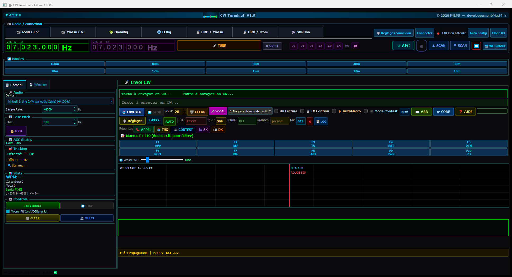

# CW Terminal

Terminal CW pour radioamateurs : **décodage du Morse en temps réel**, envoi CW, contrôle de la radio
(Icom CI-V, Yaesu CAT, HRD, OmniRig, FLRig, SDRuno), macros, mode contest, scan de bande, propagation et
log des QSO vers 13 logiciels/services.

Développé par **F4LPS** (developpement@lesf4.fr) — *Ham Spirit*.

## Installation

1. Va sur la page [**Releases**](../../releases) et télécharge `CW_Terminal_Setup_X.Y.exe`
   de la dernière version.
2. Lance l'installeur (Windows 10 ou plus récent). Si CW Terminal est déjà installé, il est **mis à jour
   sur place** et tes réglages sont conservés. Ferme CW Terminal avant d'installer.
3. Lance **CW Terminal** depuis le menu Démarrer ou le Bureau.

## Mise en route

➡️ **[Guide de mise en route rapide](MISE_EN_ROUTE.md)** : installation, premier décodage, puis réglages à faire
**sur ta radio** (Icom, Yaesu) et dans **HRD, OmniRig, FLRig, SDRuno**, envoi du CW, log, dépannage.
Il est aussi installé avec le programme (menu Démarrer → *Mise en route rapide*).

En résumé :

1. **Décoder** ne demande aucune connexion CAT : choisis l'entrée audio du récepteur, mets la radio en CW,
   clique **▶ DÉCODAGE**.
2. **Piloter la radio** : choisis l'onglet qui correspond à ton montage.

| Tu as… | Onglet |
|---|---|
| Un Icom en USB direct (IC-7300, 7610, 9700…) | **Icom CI-V** |
| Un Yaesu récent en USB (FTDX10, FT-991/991A, FTDX101…) | **Yaesu CAT** |
| HRD (ou Win4Icom) déjà connecté à la radio | **HRD / Icom** ou **HRD / Yaesu** |
| OmniRig ou FLRig déjà réglé | **OmniRig** / **FLRig** |
| Un récepteur SDRplay sous SDRuno | **SDRUno** |

> ⚠️ Premiers essais d'émission : charge fictive, et garde la main près du bouton d'arrêt. Se connecter
> à la radio **n'émet jamais rien** : seul **ENVOYER**, une macro F1–F10 ou **TUNE** fait émettre.

## Nouveautés de la V1.9.3

- **HRD + Icom : envoi CW plus sûr pour la liaison CI-V.** Le texte est envoyé en **messages de 30 caractères au plus**
  (limite de la commande CI-V de l'Icom) l'un après l'autre, au lieu d'une seule trame avec tout le texte ; les réponses de la
  radio sont lues (elles ne restent plus sur le bus partagé avec HRD) ; l'arrêt d'un message utilise la commande d'arrêt de la
  radio. Objectif : éviter le message de HRD « The connection with IC-7300 … has stopped working » après quelques envois.
- **Journal des trames CI-V** du CW : `%APPDATA%\CWTerminal\cw_terminal_civ.log` (à joindre à un rapport de problème).
- **Yaesu** : les commandes de mode CW-U et USB utilisent la bonne syntaxe (`MD03;`, `MD02;`).
- **HRD 6.8 / 6.9 : le port du serveur IP est détecté.** Il est 7809 avec HRD 6.8 mais différent avec HRD 6.9 : « Auto HRD » (et la
  connexion quand le port du champ ne répond pas) lit maintenant le port sur le processus HRD, puis essaie les ports usuels. Le
  bouton « Auto HRD » plantait à chaque clic : corrigé.
- **Icom : CW + BK-IN à la connexion.** Après la connexion (série directe, ou COM direct auxiliaire avec HRD), la radio est passée
  en **mode CW**, le **BK-IN** est activé (**semi** ou **full** au choix) et la vitesse du manipulateur est calée sur celle du
  programme ; chaque réglage est **vérifié par relecture** et le résultat s'affiche dans la barre d'état. Case « CW + BK-IN auto
  (Icom) » pour désactiver. Aucune émission n'est commandée.

## Nouveautés de la V1.9.2

- **Décodage plus lisible** : la séparation des mots s'adapte à l'espacement de l'opérateur (fini les
  « 599 5NN » collés), les lettres collées sont séparées, et plus de « ? » parasites au milieu des mots.
- **Port COM occupé** : au lieu d'un « accès refusé » obscur, le programme **nomme le logiciel** qui tient le
  port (ex. « COM13 déjà utilisé par HamRadioDeluxe.exe »).
- **Une seule copie à la fois** : une deuxième copie affiche un message au lieu de se disputer le port et la carte son.
- Le port série s'ouvre avec DTR/RTS coupés (aucun risque de mise en émission à la connexion).

## Nouveautés de la V1.9.1

- **Correctif HRD / Icom** : le programme vérifie maintenant que la radio répond sur le port CAT auxiliaire
  avant d'émettre (simple lecture de fréquence, sans émission) et l'indique clairement sinon. Avant, un
  mauvais port donnait un faux « CW envoyé ». Le port qui répond est mémorisé.
- Guide de mise en route corrigé (section HRD).

## Nouveautés de la V1.9

- **Nouveau moteur de décodage « Fit »** : au lieu de deviner « point ou trait » élément par élément, il
  cherche, sur quelques secondes de signal, le réglage (seuil, vitesse, biais des fronts) qui colle le mieux
  au timing du Morse. Il copie beaucoup mieux les signaux faibles, le fading (QSB) et la manipulation à la
  main, et n'écrit rien sur du bruit. Case **« Moteur Fit »** dans le groupe Contrôle pour revenir à l'ancien
  décodeur.
- Réparation des creux de fading dans les traits, meilleure gestion de la queue des traits, correction à un
  élément près (`......` lu comme `5`).
- **Notification de mise à jour** : info-bulle et bouton dans la barre d'état.
- **Compteur de téléchargements** dans les Réglages.

## Mises à jour

Au démarrage, le programme vérifie **silencieusement** s'il existe une version plus récente sur cette page.
Si oui, une info-bulle et le bouton **🔔 Mise à jour disponible** apparaissent dans la barre d'état ; un clic
ouvre les nouveautés et le téléchargement. Tu peux aussi vérifier à la main dans **Réglages → Mises à jour**,
ou désactiver la vérification automatique.

La vérification ne fait que **lire** la dernière release publique de ce dépôt : aucune donnée personnelle n'est
envoyée, rien n'est installé sans ton action.

## Compteur de téléchargements

Chaque téléchargement de l'installeur depuis la page *Releases* est compté par GitHub. Le total s'affiche dans
**Réglages → Mises à jour → 📥 Téléchargements**. Ce sont des téléchargements, pas des utilisateurs uniques.

## Contact

F4LPS — developpement@lesf4.fr

---

*Logiciel pour radioamateurs, usage libre — voir [LICENSE](LICENSE). Aucune garantie n'est fournie ;
utilise-le sous ta propre responsabilité et dans le respect de la réglementation applicable à ta licence
radioamateur.*
